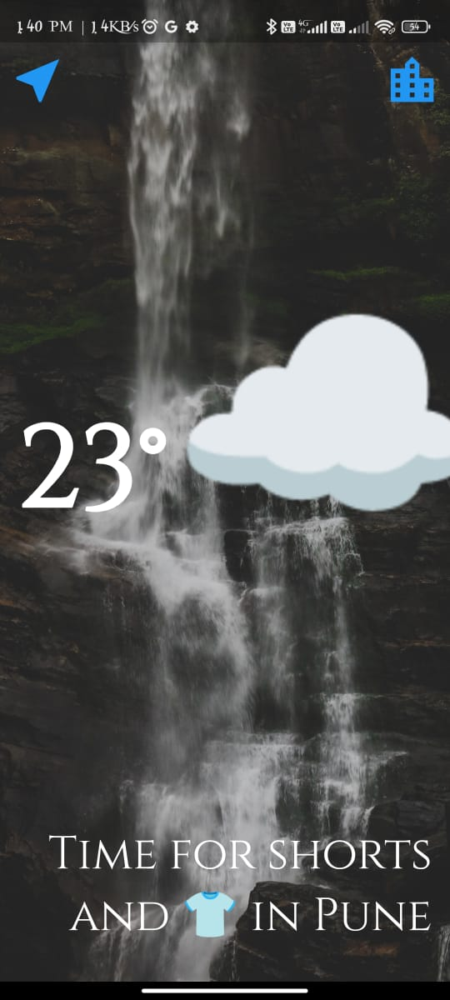
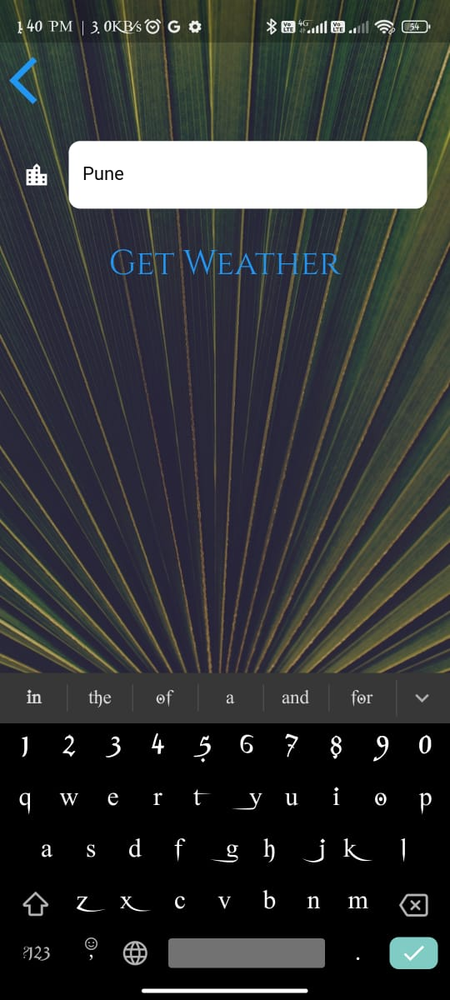

# Clima

**Clima** is a weather application built using Flutter that provides real-time weather information to users. With Clima, users can get current weather data and forecasts for various locations worldwide. The application offers a user-friendly interface and utilizes Firebase for enhanced functionality.

**FEATURES :**

Current Weather: Get the current weather information for a specific location, including temperature, weather conditions, humidity, wind speed, and more.

Location-based Weather: Clima can determine the user's current location and provide weather data accordingly.

